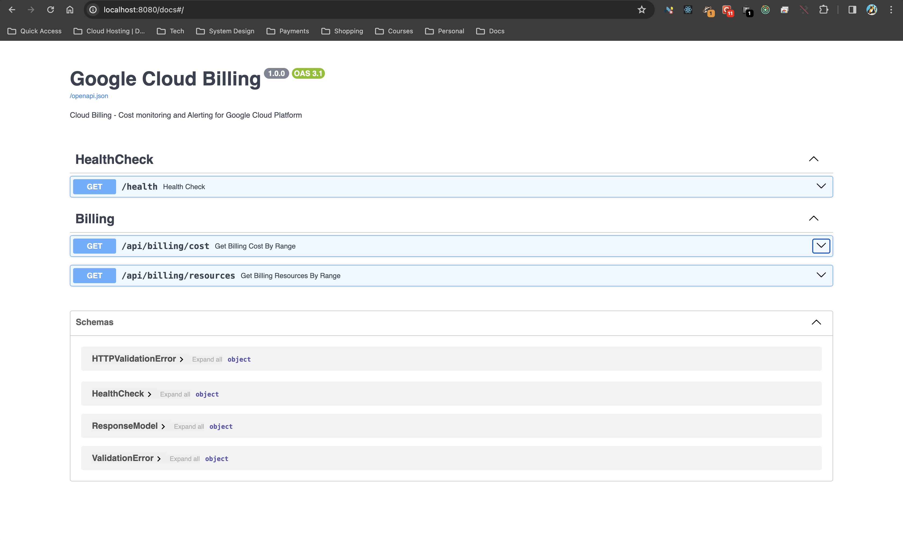

# gcp-cloud-billing
Cloud Billing - Cost Monitoring and Alerting API for Google Cloud (Billing Exports)

## Use-Case:
The project connects to Google Cloud BigQuery having Billing Export to Analyse, Monitor and Alerts for Cloud Cost and caches the results in Redis.

## Setup:
To setup the project locally, use Docker with docker-compose:

    docker-compose up -d
    
The server will be up and running at localhost:8080/

## Authentication:
Provide the environment variables defined in the `docker-compose.yml`. To authenticate to Google Cloud, you will need a Service Account JSON mounted on the container having path set to `GOOGLE_APPLICATION_CREDENTIALS`  environment variable.

## Caching and Rate Limiting:
Caching for BigQuery queries are done via Redis with a provided TTL expiry time.
The rate limiter is set that maintains a LRU cache in memory that creates mapping between user IP and requests hit per minute.

## Documentation:
The documentation for the API will be available at `/docs` route serving via `Swagger`. This is thanks to the FastAPI integration with Swagger UI.

## References:
The references for this project are mentioned below:

- [GCP Billing Export to BigQuery](https://cloud.google.com/billing/docs/how-to/export-data-bigquery)

- [FastAPI Documentation](https://fastapi.tiangolo.com/)

- [Docker Documentation](https://docs.docker.com/)

- [Redis Documentation](https://redis.io/docs/)